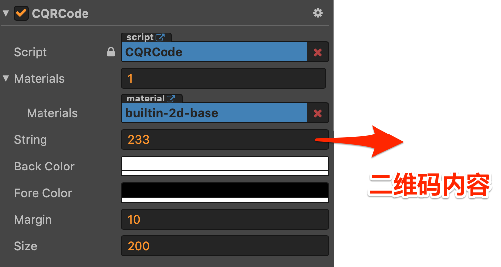
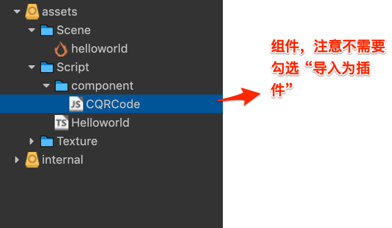

# cocosCreator-typeScript-demo-qrcode
cocosCreator项目：生成二维码组件的使用/ 使用typecript语言

[在线demo](https://nimohe.github.io/cocosCreator-typeScript-demo-qrcode/build/web-mobile/index.html)

## 说明
### 本Demo使用的js组件来自这里：
[CQRCode.js](https://github.com/ShawnZhang2015/CreatorPrimer/blob/master/assets/scripts/components/CQRCode.js)





### 项目说明
项目自身利用组件生成二维码。
- cocosCreator版本：2.2.0
- 使用语言：typeScript

## Demo主要代码
HelloWorld.ts
```ts
const {ccclass, property} = cc._decorator;

@ccclass
export default class Helloworld extends cc.Component {

    @property(cc.Label)
    label: cc.Label = null;

    @property
    text: string = 'hello';

    qrcodeNode:cc.Node;
    currHerf:string;

    // qrcodeComp:any;

    init(){
        cc.debug.setDisplayStats(false);
    }

    start () {
        // init logic
        this.label.string = this.text;
        this.qrcodeNode=this.node.getChildByName('qrcode') as cc.Node;
        cc.log(this.qrcodeNode);
        
        //获取当前页面所在的网址
        this.currHerf=window.location.href;

        this.changeQRCodeUI(this.currHerf);
    }

    /**
     * 改变二维码显示内容
     * @param str 
     */
    changeQRCodeUI(str:String){
        //写入数据
        this.qrcodeNode.getComponent('CQRCode').string=str;
    }

    /**
     * 输入框 内容发生变化
     * @param data 
     */
    editBoxChange(data:String){
        cc.log(data);
        this.changeQRCodeUI(data);
    }
}

```
